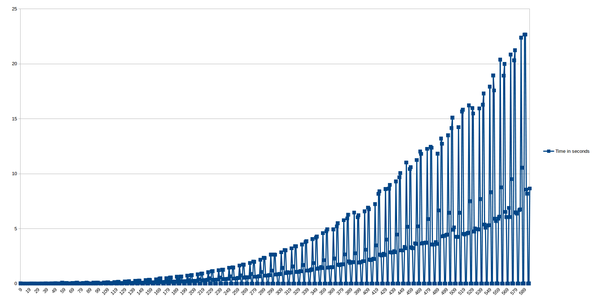

# Polynomial N Queens solution 

This is my take on the popular problem. I am trying to solve the problem in 2 stages. 

1) Initial placement of the queens in the chessboard, so there is at most 1 conflict
2) Try to resolve the 1 conflict, by trying different combinations
   
    
## Complexity

I believe worst case is O(n^5).
In reality the performance varies based on the number of queens.
For some N it performs well for other not so well.

For example it solves 1000x1000 queens in less than a second but for 900x900 it takes almost 2 minutes.
 

## Notes on the algorithm
When no optimum solution could be found I find the next best 1-conflict move.
Usually there are many 1-conflict move to choose from. If you choose the "wrong" move 
that can resolve into an infinite loop. I discovered that by choosing the 1-conflict move 
that is closest to the center of the board you avoid such loops. 

## Potential improvements
* I believe for different groups of N a different initial placement might make a difference.

## Todo
* Improve visualisation of the chessboard